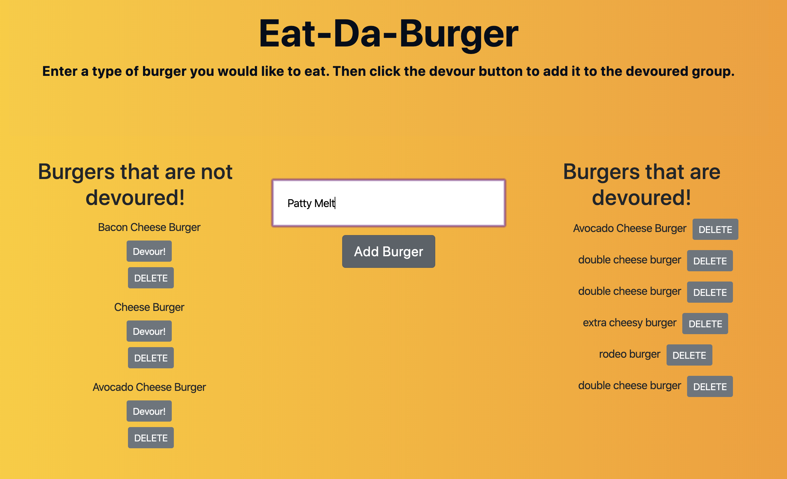

# Burger 
```
This app tracks new burgers entered by the user. The user can then send them to the "devoured" side or delete the burgers. The burger data is stored in MySQL. 
```

## Deployed on Heroku 


## Tools Used: 

  * MySql
  * Handlebars
  * Express 
  * Javascript/ JQuery 
  * Node JS
  * Bootstrap 
  * CSS/HTML

## HOW IT WORKS

### Type in a burger name. Click ```Add Burger```
* The burger is then added to the left.
* User can then click Devour to add it to the right side.
* User also has the option to delete all burgers. 



## Acknowledgments

* Background from [uiGradients](https://uigradients.com/)